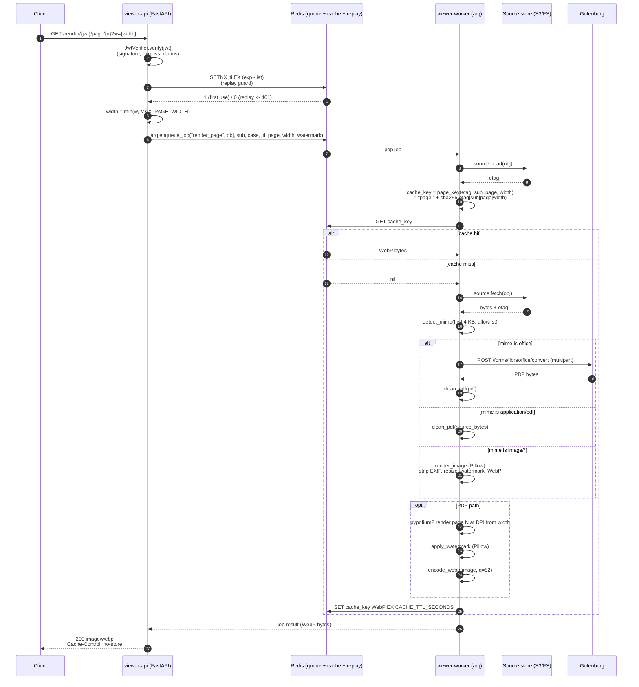

# Data flow: one page render

This page traces a single `GET /render/{jwt}/page/{n}` request from the client
all the way to the WebP bytes coming back. For the container-level picture see
[overview](overview.md); for the modules touched see
[component-reference](component-reference.md).

## Sequence diagram



## Step-by-step

The numbers below match the arrows in the diagram.

### 1. Request hits the API

The client sends `GET /render/{jwt}/page/{n}?w={width}`. The token sits in the
URL path so the same endpoint can be embedded as `` directly. Ingress
forwards the request to `viewer-api`.

### 2. JWT verification

`viewer-api` decodes the token using the configured algorithm (`RS256` or
`HS256`), checks the signature against the configured key, verifies the
`exp`/`iat`/`iss` claims, and requires `sub`, `obj`, `case`, and `jti` to be
present. Failure returns 401 immediately. The viewer never trusts
upstream-injected user headers in place of the JWT.

### 3-4. Replay guard

The API issues `SETNX replay:{jti} "1" EX (exp - iat)` against Redis. A return
of `1` means this is the first use; `0` means the token has already been
spent, and the API returns 401. The TTL is the remaining lifetime of the
token, so the entry expires exactly when the token would have expired anyway.

### 5. Width clamp

Before enqueueing, the API clamps `w` to `[1, MAX_PAGE_WIDTH]`. This is the
last point at which client input shapes the cache key; everything downstream
sees the clamped value.

### 6-7. Enqueue

The API calls `arq.enqueue_job("render_page", ...)` with the relevant claims
and the clamped width. `arq` writes the job into Redis; the API awaits the
result on the same Redis-backed channel with a timeout equal to
`RENDER_TIMEOUT_SECONDS`. A worker pops the job.

### 8-9. ETag lookup

The worker calls `source.head(obj)` to get the source object's ETag without
downloading the body. This is cheap (a single HEAD on S3) and avoids fetching
the source at all on a cache hit.

### 10. Cache key

The worker derives:

```text
page_key(etag, sub, page, width) = "page:" + sha256(f"{etag}|{sub}|{page}|{width}").hexdigest()
```

Every input that can change the rendered pixels is in the key:

- `etag` — if the source object changes, the cache misses automatically.
- `sub` — the watermark is baked into the pixels, so different users get
  different cache entries.
- `page` and `width` — different page or zoom level = different render.

`jti` is intentionally *not* in the page cache key: page renders should be
shareable across multiple short-lived tokens issued to the same user for the
same object at the same width. (`jti` *is* in the cleaned-PDF intermediate
key — see below.)

### 11-12. Cache check

`GET cache_key`. On a hit, the worker returns the WebP bytes immediately —
no source fetch, no parser invocation, no Gotenberg call. This is the hot
path and is the load-bearing performance property of the system.

### 13-14. Source fetch

On a miss, the worker calls `source.fetch(obj)` and collects the byte stream
into memory. The collection is bounded; oversized sources fail before any
parser runs.

### 15. Mime detection

The first 4 KB of the body is fed to `python-magic`. The detected mime is
checked against the allowlist (`ALLOWED_MIMES`). Anything not on the list
returns 415 and no further parsing happens. **Extension is never trusted.**

### 16-22. Pipeline dispatch

The pipeline dispatcher routes by detected mime:

- **`application/pdf`**: `pikepdf` opens the source, strips dangerous
  features (`/JavaScript`, `/JS`, `/EmbeddedFile`, `/EmbeddedFiles`, `/AA`,
  `/OpenAction`, `/Launch`, `/GoToR`, `/ImportData`, `/SubmitForm`), drops
  attachments, removes encryption, and emits a cleaned PDF. The cleaned PDF
  is cached at `pdf-clean:{sha256(etag|jti)}` so subsequent page renders in
  the same session skip the clean step.
- **Office formats** (`docx`, `pptx`, `xlsx`, `odt`, `ods`, `odp`, `rtf`):
  the worker POSTs the source as multipart form data to
  `{GOTENBERG_URL}/forms/libreoffice/convert` and reads the PDF response
  body. The returned PDF then goes through the same `pikepdf` clean step as
  above.
- **Raster images** (`png`, `jpeg`, `webp`, `heic`, `tiff`, `gif`): Pillow
  opens the image, strips EXIF and all metadata, resizes to the clamped
  width, applies the watermark, and encodes WebP. No PDF detour.

For PDF (native or Gotenberg-produced), `pypdfium2` opens the cleaned PDF and
rasterizes page `N-1` (0-indexed inside pypdfium2) at
`DPI = clamp(width / page_pt_width * 72, 72, 300)` to an RGB buffer.

### 23. Watermark

The rendered RGB image is composited with an RGBA watermark layer drawn by
`PIL.ImageDraw`: a diagonal semi-transparent string `<sub> · <case> · <ISO
timestamp>` tiled at multiple positions across the page. The watermark is
baked into the pixel data, not added as a DOM/CSS overlay, so the user cannot
remove it client-side.

### 24. WebP encode

The watermarked image is encoded to WebP (`quality=82`, `method=4`).

### 25. Cache write

`SET cache_key WebP EX CACHE_TTL_SECONDS` (default 900). Future requests for
the same `(etag, sub, page, width)` tuple within the TTL hit on step 12.

### 26-27. Response

`arq` returns the WebP bytes to the awaiting API request. The API responds:

```text
HTTP/1.1 200 OK
Content-Type: image/webp
Cache-Control: no-store
```

`no-store` is critical: the response contains PII (the user's identity is in
the watermark), so it must not land in any shared cache.

## Manifest path (sketch)

`GET /render/{jwt}/manifest` follows the same JWT + replay-guard prefix but
enqueues `render_manifest` instead. The worker fetches the source, detects
the mime, runs the PDF clean (or Gotenberg conversion plus clean) to discover
page count and dimensions, and returns:

```json
{
  "mime": "...",
  "pages": 12,
  "dims": [{"w": 1700, "h": 2200}, ...],
  "etag": "sha256:...",
  "ttl_seconds": 900
}
```

The cleaned PDF produced here is cached at `pdf-clean:{sha256(etag|jti)}` so
subsequent page renders within the same session reuse it.

## Failure paths

- **JWT invalid / expired / replayed** → 401 at step 2 or 4; no enqueue.
- **Mime not in allowlist** → 415 at step 15; no further parsing.
- **Source not found** → 404 surfaced from the source backend.
- **Per-page render timeout exceeded** → 504; the worker subprocess is
  killed, the queue continues.
- **All workers busy / queue full** → 503; the API gives up rather than
  block ingress.
- **Worker crashed mid-render** → 500 with an `X-Request-ID` header; the
  request ID lands in the audit log for correlation. No source bytes appear
  in the error body.

Errors never include source-derived content — only our static mime
allowlist and size caps appear in messages.
